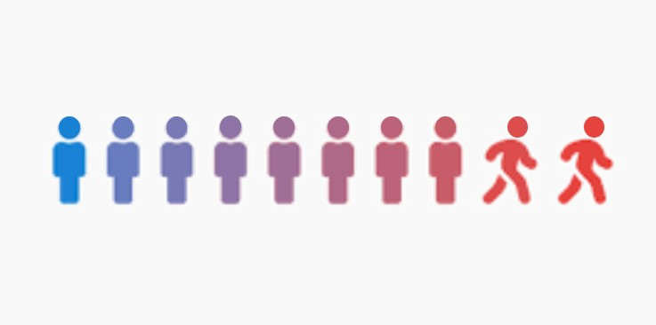
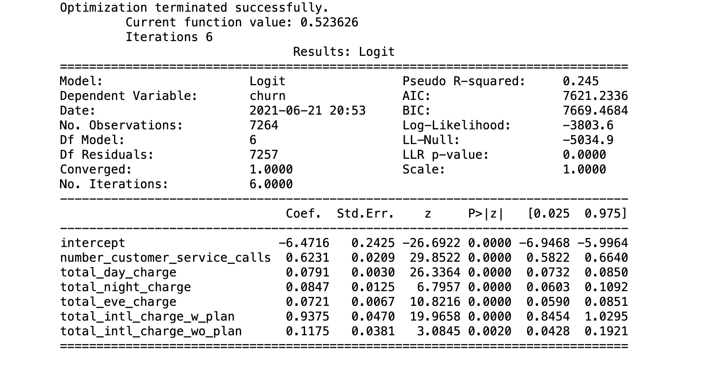

# Customer Churn Prediction

What causes customer churn at Telecom companies? In this project I build a logistic regression model and use it as a lens to understand what drives customers to cancel their subscription. The data set is from a Kaggle competition called "Customer Churn Prediction 2020" (https://www.kaggle.com/c/customer-churn-prediction-2020/overview)

### Data

-The dataset has 4250 observations. Each observaton contains 19 features and 1 boolean variable "churn" which indicates whether or not that particular user churned.

-Like most customer churn datasets, this one has a class imbalance problem. Only 14% of the obervations are users that churned. To offset the issues caused by the class imbalance, the churned user records were resampled with replacement until the ratio of churned to active customers was 1:1.

-Below are the features I decided to include in my final model.

### Logistic Regression

Independent Variable Definitions:

-"total_day_charge", numerical. Total charge of day calls.

-"total_eve_charge", numerical. Total charge of evening calls.

-"total_night_charge", numerical. Total charge of night calls.

-"total_intl_charge_w_plan", numerical. Total charge of international calls for those with an international phone plan.

-"total_intl_charge_w0_plan", numerical. Total charge of international calls for those without an international phone plan.

-"number_customer_service_calls", numerical. Number of calls to customer service.

Dependent Variable Definition:

-"churn", 𝑦𝑒𝑠/𝑛𝑜. Customer churn.

## Regession Model Obervations
- 

