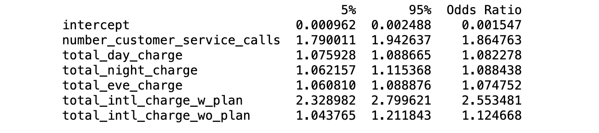

# Customer Churn Prediction

What causes customer churn at Telecom companies? In this project I build a logistic regression model and use it as a lens to understand what drives customers to cancel their phone subscriptions. The data set is from a Kaggle competition called "Customer Churn Prediction 2020" (https://www.kaggle.com/c/customer-churn-prediction-2020/overview)

### Data

-The dataset has 4250 observations. Each observaton contains 19 features and 1 boolean variable "churn" which indicates whether or not that particular user churned.

-Like most customer churn datasets, this one has a class imbalance problem. Only 14% of the obervations are users that churned. To offset the issues caused by the class imbalance, the churned user records were resampled with replacement until the ratio of churned to active customers was 1:1.

-Below are the features I decided to include in the final model.

### Logistic Regression

Independent Variable Definitions:

-"total_day_charge", numerical. Total charge of day calls.

-"total_eve_charge", numerical. Total charge of evening calls.

-"total_night_charge", numerical. Total charge of night calls.

-"total_intl_charge_w_plan", numerical. Total charge of international calls for those with an international phone plan.

-"total_intl_charge_w0_plan", numerical. Total charge of international calls for those without an international phone plan.

-"number_customer_service_calls", numerical. Number of calls to customer service.

Dependent Variable Definition:

-"churn", 𝑦𝑒𝑠/𝑛𝑜. Customer churn.

## Regression Output

## Regression Performance

## Regression Calibration

## Evidence for Reliability of Regression:

- Both the signs and the size of the various coefficients make sense

- All p-values are small

- AUC is above 0.7

## Evidence against Reliability of Regression:

- Three of the bins in the calibraiton curve are about 10% off from perfect calibration

## Regession Model Obervations
- Every customer service call increases the odds that a customer will churn by about 85%. If the customer service experience has not been evaluated lately, it could be a good time to reevaluate the experience and calculate how many users might be retained if the experience were more efficient. Another idea is to give customer service reps the ability to offer discounts to users when they see fit to try and offset the frustrations the user may be calling about.
- A one dollar increae in the phone bill of a user who called international with an internationl plan increases the odds of churn by about 150%. These users have the highest probability of churn and it would be heplful to investigate this further with any other available data on these users to see if there is an explanation for their high probability of churining. Perhaps these are users who are living abroard temporariliy and most of them churn after they return to their home country.
- As customers are charged another dollar for day calls, evening calls, night calls, or international calls without a plan the increase in odds of churning is about the samee, around 8%. This 8% increase in odds of churning is a reference point that shows the high liklihood of international plan users to churn.

