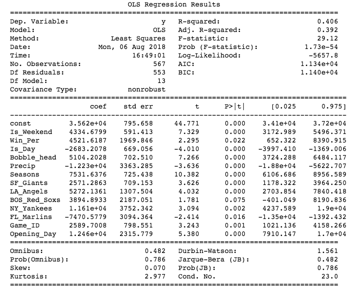
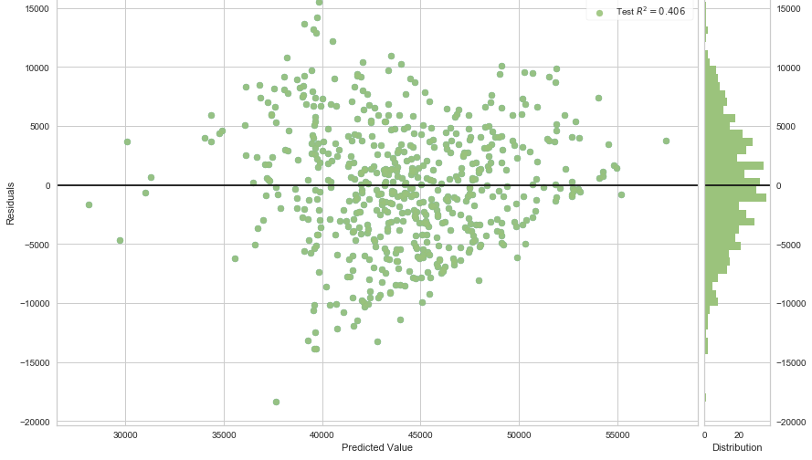

# Linear Regression for Dodger Game Attendance

How accurately can a linear regression predict attendance at individual Dodger home games? I built a linear regression to answer that question and to see if the model produces any useful insights for the Dodgers.

### Data 
- The attendance data that the model is trained on comes from all of the home games between 2011 and 2017.
 
- The attendance figures and game information come from baseball-reference.com.

- The weather data comes from OpenWeatherMap.

- The bobble head data comes from the Dodgers' website.

## Linear Regression

Independent Variable Definitions:

- Is_Weekend: A dummy variable that takes the value 1 if the game is being played on a Saturday or Sunday.
- Win_Per: The Dodger's winning percentage in decimal form at the time of the game.
- Is_Day: A dummy variable that takes the value 1 if the game is a day game.
- Bobble_head: A dummy variable that takes the value 1 if bobble heads are given away at the game.
- Precip: The amount of forecasted precipitation at Dodger Stadium in mm.
- Seasons: A variable that takes a value 1-7 to represent the season in which the game is played.
- Opposing Team Variables: These are dummy variables that take the value 1 if the Dodgers are playing this team.
- Game_ID: The number of games the Dodgers have played  before this game in the current season.
- Opening_Day: A dummy variable that takes the value 1 if it is the first home game of the season.

Dependent Variable Definition:

- The number of fans attending a specific Dodger home game.

Below are the regression coefficients and other regression statistics. All of the independent variables were normalized.

If you are interested in the feature engineering process for this regression take a look at the process [here](https://github.com/amatthi55/Portfolio/blob/master/Dodger_Stadium_Regression/Linear%20Regression.ipynb).

##### Evidence for Reliability of Regression:

- Both the signs and the size of the various coefficients make sense.
- All p-values are small.

##### Evidence against Reliability of Regression:

- Times series data can make linear regression models poor predictors.
- The below chart of the residuals shows heteroskedasticity (the variance of residuals decreases as the predicted value increases).

As we can see from the above residual chart, most predicted values are within 5,000 of the actual attendance number. We can also see linearity in the residual chart, suggesting that the model is missing one or more important features. 

## Regession Model Obervations
- The Is_Day coefficient indicates that day games on average attract less fans than night games. This suggests that the Dodgers should attempt to host as many games as possible at night.
- The Bobble_head coefficient is around 5,000 which suggests that bobble head games attract around 5,000 more fans than regular games. Perhaps the Dodgers could use this information to better understand the profitability of the bobble head promotions.
- The team that attracts the largest crowd at Dodger Stadium is the New York Yankees, followed by the Los Angeles Angeles and the Boston Red Sox. The Dodger may not want to schedule these teams for opening day since opening day already attracts a significantly larger than average crowd.
- The model has an adjusted R squared score of around .4 which is not a terrible score but I am sure it could be improved if more features, such as Dodgers ad spend and ticket prices, were added to the model. Unfortunately I do not have access to the data of these missing features.
- Overall, the linear regression, trained with easily accessible data, is a so-so predictor of Dodger Stadium attendance but it does shed light on the forces affecting attendance.

